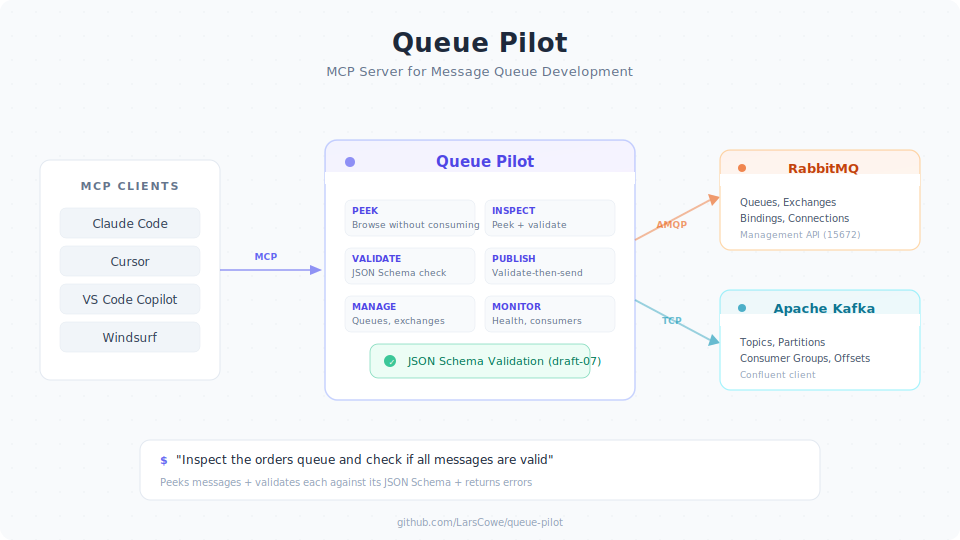

# Queue Pilot

[](https://www.npmjs.com/package/queue-pilot)
[](LICENSE)
[](https://github.com/LarsCowe/queue-pilot/actions/workflows/ci.yml)
[](https://www.npmjs.com/package/queue-pilot)
[](https://nodejs.org/)
[](https://www.typescriptlang.org/)

MCP server for message queue development — combines message inspection with JSON Schema validation. Supports **RabbitMQ** and **Kafka**.

Designed for integration projects where multiple teams communicate via message brokers: inspect queues/topics, view messages, and validate payloads against agreed-upon schemas — all from your AI assistant.

<p align="center">
  
</p>

## Features

- **Multi-broker support** — RabbitMQ and Apache Kafka via a unified adapter interface
- **Message Inspection** — Browse queues/topics, peek at messages without consuming them
- **Schema Validation** — Validate message payloads against JSON Schema definitions
- **Combined Inspection** — `inspect_queue` peeks messages AND validates each against its schema
- **Validated Publishing** — `publish_message` validates against a schema before sending — invalid messages never hit the broker
- **Queue Management** — Create queues/topics, bindings, and purge messages for dev/test workflows
- **Broker Info** — List exchanges, bindings, consumer groups, and partition details

## Prerequisites

- **Node.js >= 22** — Required runtime ([check with `node --version`](https://nodejs.org/))
- **A message broker:**
  - **RabbitMQ** with the [management plugin](https://www.rabbitmq.com/docs/management) enabled (HTTP API on port 15672), or
  - **Apache Kafka** (requires `@confluentinc/kafka-javascript` — install separately: `npm install @confluentinc/kafka-javascript`)
- **An MCP-compatible client** — Claude Code, Claude Desktop, Cursor, VS Code (Copilot), Windsurf, etc.

## Quick Start

### 1. Define your schemas

Create JSON Schema files in a directory:

`schemas/order.created.json`:

```json
{
  "$id": "order.created",
  "$schema": "http://json-schema.org/draft-07/schema#",
  "title": "Order Created",
  "description": "Emitted when a new order is placed",
  "version": "1.0.0",
  "type": "object",
  "required": ["orderId", "amount"],
  "properties": {
    "orderId": { "type": "string" },
    "amount": { "type": "number" }
  }
}
```

### 2. Add to your MCP client

Generate the config for your client with `queue-pilot init`:

```bash
# RabbitMQ (default)
npx queue-pilot init --schemas /absolute/path/to/your/schemas

# Kafka
npx queue-pilot init --schemas /absolute/path/to/your/schemas --broker kafka
```

For a specific client, use `--client`:

```bash
# Claude Code — outputs a ready-to-run `claude mcp add` command
npx queue-pilot init --schemas ./schemas --client claude-code

# VS Code (Copilot)
npx queue-pilot init --schemas ./schemas --client vscode

# Cursor
npx queue-pilot init --schemas ./schemas --client cursor

# Claude Desktop
npx queue-pilot init --schemas ./schemas --client claude-desktop

# Windsurf
npx queue-pilot init --schemas ./schemas --client windsurf
```

Non-default settings are included as environment variables (not CLI args) to avoid exposing credentials in `ps` output:

```bash
# RabbitMQ with custom credentials
npx queue-pilot init --schemas ./schemas --rabbitmq-user admin --rabbitmq-pass secret

# Kafka with SASL authentication
npx queue-pilot init --schemas ./schemas --broker kafka --kafka-brokers kafka:9092 --kafka-sasl-mechanism plain --kafka-sasl-username admin --kafka-sasl-password secret
```

> **Windows note:** If `npx` fails to resolve the package, try `cmd /c npx queue-pilot init ...`.

<details>
<summary>Manual configuration (without init)</summary>

Add the following server configuration to your MCP client:

**RabbitMQ:**

```json
{
  "mcpServers": {
    "queue-pilot": {
      "command": "npx",
      "args": [
        "-y",
        "queue-pilot",
        "--schemas", "/absolute/path/to/your/schemas"
      ]
    }
  }
}
```

**Kafka:**

```json
{
  "mcpServers": {
    "queue-pilot": {
      "command": "npx",
      "args": [
        "-y",
        "queue-pilot",
        "--schemas", "/absolute/path/to/your/schemas",
        "--broker", "kafka"
      ],
      "env": {
        "KAFKA_BROKERS": "localhost:9092"
      }
    }
  }
}
```

> **Schema path tip:** Use an absolute path for `--schemas`. Relative paths resolve from the MCP client's working directory, which may not be your project root.

| Client | Config file |
|--------|------------|
| Claude Code | `.claude/mcp.json` (project) or `~/.claude/mcp.json` (global) |
| Claude Desktop | `claude_desktop_config.json` |
| Cursor | `.cursor/mcp.json` |
| VS Code (Copilot) | `.vscode/mcp.json` (uses `"servers"` instead of `"mcpServers"`) |
| Windsurf | `~/.codeium/windsurf/mcp_config.json` |

</details>

<details>
<summary>Development (running from source)</summary>

```json
{
  "mcpServers": {
    "queue-pilot": {
      "command": "npx",
      "args": [
        "tsx",
        "src/index.ts",
        "--schemas", "./schemas"
      ],
      "cwd": "/path/to/queue-pilot"
    }
  }
}
```

</details>

### 3. Use it

Ask your assistant things like:

- "Which queues are there and how many messages do they have?"
- "Show me the messages in the orders queue"
- "Inspect the registration queue and check if all messages are valid"
- "What schemas are available?"
- "Validate this message against the order.created schema"
- "Publish an order.created event to the events exchange"
- "Create a queue called dead-letters and bind it to the events exchange"
- "Purge all messages from the orders queue"
- "List all consumer groups" (Kafka)
- "Show me the partition details for the orders topic" (Kafka)

## MCP Tools

### Universal tools (all brokers)

| Tool | Description |
|------|-------------|
| `list_schemas` | List all loaded message schemas |
| `get_schema` | Get the full definition of a specific schema |
| `validate_message` | Validate a JSON message against a schema |
| `list_queues` | List all queues/topics with message counts |
| `peek_messages` | View messages in a queue/topic without consuming them |
| `inspect_queue` | Peek messages + validate each against its schema |
| `get_overview` | Get broker cluster overview |
| `check_health` | Check broker health status |
| `get_queue` | Get detailed information about a specific queue/topic |
| `list_consumers` | List consumers (RabbitMQ) or consumer groups (Kafka) |
| `publish_message` | Publish a message with optional schema validation gate |
| `purge_queue` | Remove all messages from a queue/topic |
| `create_queue` | Create a new queue/topic |
| `delete_queue` | Delete a queue/topic |

### RabbitMQ-specific tools

| Tool | Description |
|------|-------------|
| `list_exchanges` | List all RabbitMQ exchanges |
| `create_exchange` | Create a new exchange |
| `delete_exchange` | Delete an exchange |
| `list_bindings` | List bindings between exchanges and queues |
| `create_binding` | Bind a queue to an exchange with a routing key |
| `delete_binding` | Delete a binding |
| `list_connections` | List all client connections to the broker |

### Kafka-specific tools

| Tool | Description |
|------|-------------|
| `list_consumer_groups` | List all consumer groups with their state |
| `describe_consumer_group` | Show members, assignments, and state of a consumer group |
| `list_partitions` | Show partition details for a topic (leader, replicas, ISR) |
| `get_offsets` | Show earliest/latest offsets per partition |

## MCP Prompts

Pre-built workflow templates that guide your AI assistant through multi-step operations.

| Prompt | Parameters | Description |
|--------|-----------|-------------|
| `debug-flow` | `exchange`, `queue` | Trace bindings from exchange to queue, peek messages, and validate each against its schema |
| `health-report` | _(none)_ | Check broker health, get cluster overview, flag queues with backed-up messages |
| `schema-compliance` | `queue` _(optional)_ | Peek messages and validate each against its schema — for one queue or all queues |

Usage example (in any MCP-compatible client):

> "Use the debug-flow prompt for exchange 'events' and queue 'orders'"

## MCP Resources

Each loaded schema is exposed as a readable MCP resource at `schema:///<schema-name>`.

Clients that support MCP resources can read schema definitions directly without calling tools. For example, a schema loaded from `order.created.json` is available at `schema:///order.created`.

## Schema Format

Schemas follow JSON Schema draft-07 with a few conventions:

- `$id` — Message type identifier (matches the `type` property on messages)
- `version` — Schema version (custom field, not validated by JSON Schema)
- Standard JSON Schema validation including `required`, `properties`, `format` etc.

Schema matching: when inspecting a queue, the message's `type` property is used to find the corresponding schema by `$id`.

## CLI Arguments

### General

| Argument | Default | Description |
|----------|---------|-------------|
| `--schemas` | (required) | Path to directory containing JSON Schema files |
| `--broker` | `rabbitmq` | Broker type: `rabbitmq` or `kafka` |

### RabbitMQ

| Argument | Default | Description |
|----------|---------|-------------|
| `--rabbitmq-url` | `http://localhost:15672` | RabbitMQ Management API URL |
| `--rabbitmq-user` | `guest` | RabbitMQ username |
| `--rabbitmq-pass` | `guest` | RabbitMQ password |

### Kafka

| Argument | Default | Description |
|----------|---------|-------------|
| `--kafka-brokers` | `localhost:9092` | Comma-separated broker addresses |
| `--kafka-client-id` | `queue-pilot` | Kafka client ID |
| `--kafka-sasl-mechanism` | _(none)_ | SASL mechanism: `plain`, `scram-sha-256`, `scram-sha-512` |
| `--kafka-sasl-username` | _(none)_ | SASL username |
| `--kafka-sasl-password` | _(none)_ | SASL password |

## Environment Variables

Connection settings can also be configured via environment variables. CLI arguments take priority over environment variables, which take priority over defaults.

### RabbitMQ

| Variable | Default | Description |
|----------|---------|-------------|
| `RABBITMQ_URL` | `http://localhost:15672` | RabbitMQ Management API URL |
| `RABBITMQ_USER` | `guest` | RabbitMQ username |
| `RABBITMQ_PASS` | `guest` | RabbitMQ password |

### Kafka

| Variable | Default | Description |
|----------|---------|-------------|
| `KAFKA_BROKERS` | `localhost:9092` | Comma-separated broker addresses |
| `KAFKA_CLIENT_ID` | `queue-pilot` | Kafka client ID |
| `KAFKA_SASL_MECHANISM` | _(none)_ | SASL mechanism |
| `KAFKA_SASL_USERNAME` | _(none)_ | SASL username |
| `KAFKA_SASL_PASSWORD` | _(none)_ | SASL password |

This is useful with MCP client `env` blocks to avoid exposing credentials in `ps` output:

```json
{
  "mcpServers": {
    "queue-pilot": {
      "command": "npx",
      "args": ["-y", "queue-pilot", "--schemas", "/absolute/path/to/your/schemas"],
      "env": {
        "RABBITMQ_URL": "http://localhost:15672",
        "RABBITMQ_USER": "admin",
        "RABBITMQ_PASS": "secret"
      }
    }
  }
}
```

## Development

```bash
npm install
npm test                    # Unit tests
npm run test:coverage       # Coverage report
npm run build               # TypeScript compilation
npm run typecheck           # Type check

# Integration tests (requires RabbitMQ)
docker compose up -d --wait
npm run test:integration
```

## Tech Stack

- TypeScript (strict mode, ESM)
- [MCP SDK](https://github.com/modelcontextprotocol/typescript-sdk) v1.26.0
- [Ajv](https://ajv.js.org/) for JSON Schema validation
- [Zod](https://zod.dev/) for MCP tool parameter definitions
- [Vitest](https://vitest.dev/) for testing
- RabbitMQ Management HTTP API
- [Confluent Kafka JavaScript](https://github.com/confluentinc/confluent-kafka-javascript) (optional, for Kafka support)

## License

MIT
